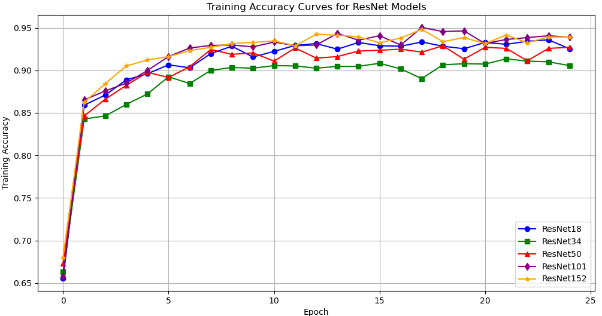
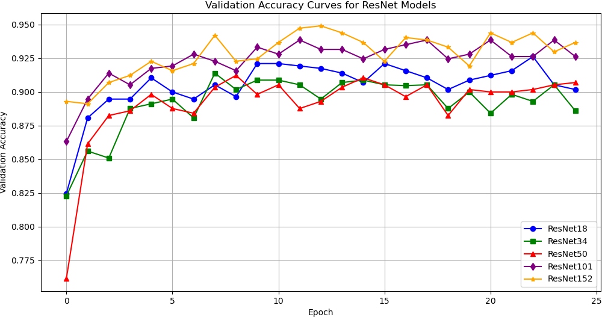
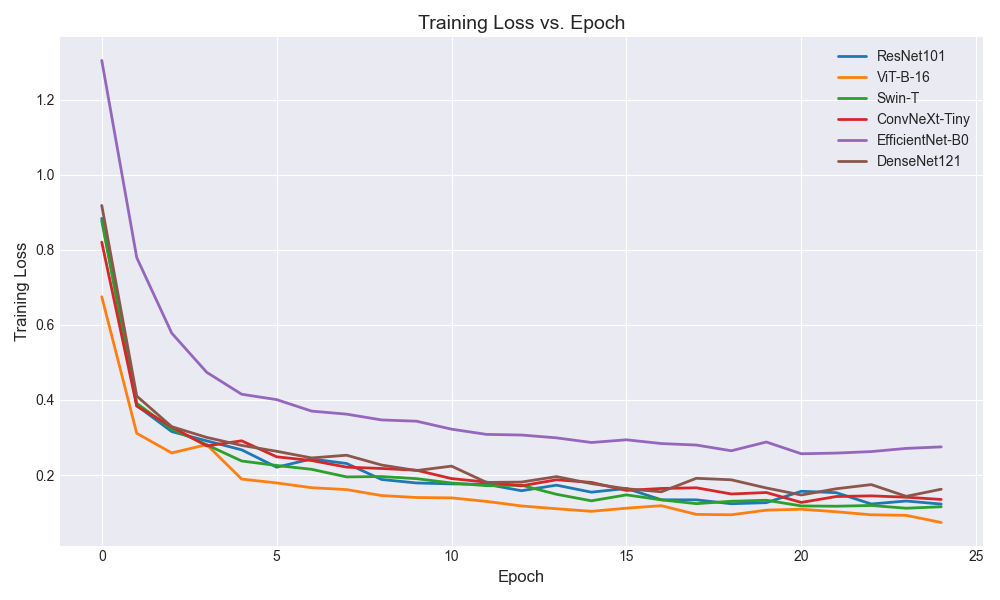
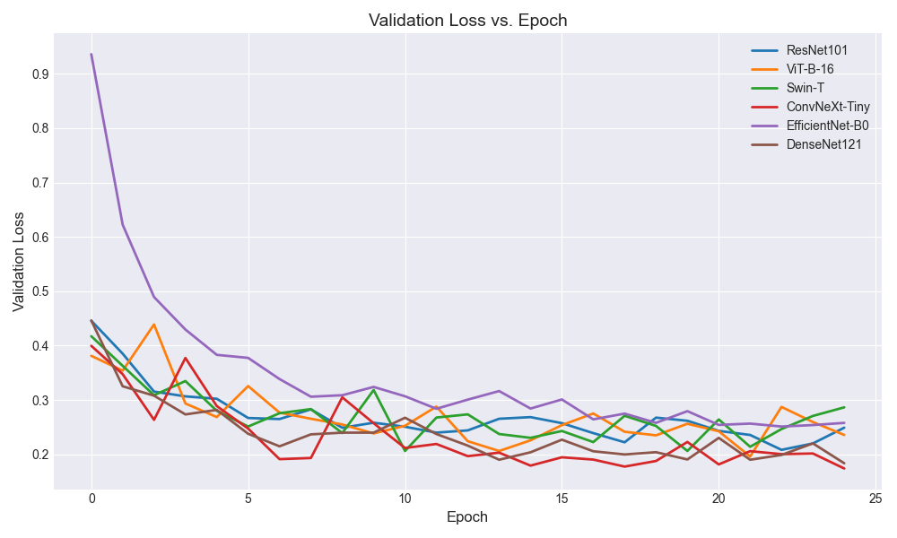

# Flower Classification Experiment
[]([model_comparision_1 | Kaggle](https://www.kaggle.com/code/ko0kip/model-comparision-1/edit))
## Overview
This repository contains the code for a flower classification project using deep learning models, conducted as part of the SYSUSZ ECE371 assignment. The project focuses on classifying a dataset of flower images into five categories, exploring the impact of network depth and model architecture on classification performance. Two experiments were performed: the first assesses ResNet models with varying depths (ResNet18, ResNet34, ResNet50, ResNet101, ResNet152), and the second compares six architectures (ResNet101, DenseNet121, EfficientNet-B0, ViT-B-16, Swin-T, ConvNeXt-Tiny). Key findings include ResNet101 achieving a validation accuracy of 0.920, with deeper models showing overfitting, while ConvNeXt-Tiny excelled with a validation accuracy of 0.9474.

## Dataset
The Flower Dataset used in this project consists of images across five flower categories, split into 80% training and 20% validation sets. Preprocessing includes random cropping to 224x224, augmentations (flips, rotations, color jitter), and normalization (mean [0.485, 0.456, 0.406], std [0.229, 0.224, 0.225]). The dataset is expected to be located in the directory `EX2/flower_dataset/`.

## Requirements
To run the code, ensure you have the following installed:
- Python 3.8+
- PyTorch 
- torchvision
- matplotlib
Install dependencies using:
```bash
pip install torch torchvision matplotlib
```

## Usage
1. Clone the Repository
```bash
  git clone https://github.com/SYSUSZ-ECE371/assignment-1-image-classification-by-using-deep-models-Kokeip.git
cd assignment-1-image-classification-by-using-deep-models-Kokeip
```
2. Prepare the Dataset
   - Place the Flower Dataset in `EX2/flower_dataset/`
3. Run the Experiments
```bash
python model_comparison.py
```
- The script will train each model for 25 epochs, save the best weights in `Ex2/work_dir/`, and generate loss and accuracy plots.
## Results
  
  
  
  


  
  ## Insights
  - Moderate network depth (e.g., ResNet101) balances accuracy and generalization for flower classification.
  - Hybrid architectures like ConvNeXt-Tiny offer superior performance and efficiency, making them ideal for this task.
  - Large models like ViT-B-16 may overfit on smaller datasets, requiring careful tuning.
  ## Acknowledgments
  This project was completed as part of the SYSUSZ ECE371 course assignment. Thanks to the course instructors for guidance and Kaggle for providing computational resources.